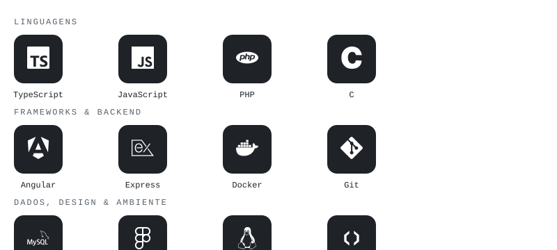

<div align="center">

<picture>
  <source media="(prefers-color-scheme: dark)" srcset="assets/header-dark.svg">
  
</picture>

</div>

<br>

## Sobre mim

```php
class Gabriel {
    public $location    = "Joinville, SC — Brasil";
    public $education   = "Engenharia de Software — em andamento (Católica SC)";
    public $background  = "Full Stack Developer @ UltraLims";
    public $formacao    = ["Dev de Sistemas — SENAI SC", "Especialização em Angular — Proway"];
    public $focus       = ["back-end", "front-end", "arquitetura de software", "design patterns"];
    public $learning    = ["Angular avançado", "clean code & SOLID", "system design"];
    public $offTheClock = ["café", "jogos", "artigos técnicos"];

    public function howDoIWork() {
        return "construo e evoluo aplicações do zero — " .
               "com obsessão por clareza de código e arquitetura que faz sentido";
    }
}
```

## Minha Stack

<div align="center">

<picture>
  <source media="(prefers-color-scheme: dark)" srcset="assets/stack-dark.svg">
  
</picture>

</div>

<div align="center">

<picture>
  <source media="(prefers-color-scheme: dark)" srcset="assets/terminal-dark.svg">
  
</picture>

<br><br>

<picture>
  <source media="(prefers-color-scheme: dark)" srcset="https://quotes-github-readme.vercel.app/api?type=horizontal&theme=dark">
  
</picture>

<br><br>

[**LinkedIn**](https://linkedin.com/in/gabrielgvcb) &nbsp;·&nbsp; [**Instagram**](https://instagram.com/gabrielgvcb) &nbsp;·&nbsp; [**Email**](mailto:gabriel.vinicius06.gb@gmail.com)

<br>

</div>
